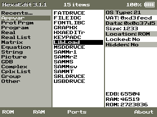
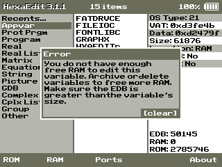

# HexaEdit CE

HexaEdit CE is a powerful on-calc hex editor for the TI-84 Plus CE. It allows you to edit:

* Any TI-OS variable (programs, appvars, equations, etc.)
* RAM
* "Ports" (0xE00000 - 0xFFFFFF)

It also enables you to view, but not edit, the calculator's ROM.




The GUI editor offers a wide array of features, such as:

* Direct letter-and-digit input (Pressing "A" writes its ASCII code.)
* Cut-copy-paste
* Automatic decimal translation of up to three bytes allowing for little-endian storage
* A Find function for looking up short strings
* A quick Goto function
* And, an undo function

To find out more about HexaEdit CE, please visit its [Cemetech forum thread](https://www.cemetech.net/forum/viewtopic.php?t=16759).

## Installation

After extracting the HexaEdit_CE.zip file, send the following file to your calculator using a computer-calculator link program, such as TI-Connect CE or TILP:

* HEXAEDIT.8xp

This program requires the latest C libraries produced by the CE-Programming team.

## Warning!
HexaEdit is like Linux: it allows you to do almost anything you want, but it does not prevent you from making serious mistakes. Arbitrarily writing values to RAM, Ports, or TI-OS variables might make your calculator crash, or, in the worst case, it will irreversibly damage your device ("bricking").

As it states in the BSD-3 license, the author is not responsible for any damage that this program may inflict.

**Make sure you know what you are doing before using this program!**

## Overview of the Main Menu

The main menu displays a three-column interface that hierarchically categorizes each variable. The rightmost column shows important metadata about each variable, like size, VAT location, and memory location. The bottom toolbar provides easy access to HexaEdit's ROM viewer, RAM editor, and Ports editor.

The main menu also shows the amount of free RAM and free ROM on the calculator in the lower right-hand corner. The amount of free RAM does not include what HexaEdit is using at run-time. Above the RAM and ROM fields is one called *EDB*, "**ED**it **B**uffer Size", and it shows the edit buffer's capacity, in bytes. You cannot edit a variable with a greater size than the *EDB*. To increase the *EDB*'s capacity, you can archive or delete other variables on the calculator.



## Controls

HexaEdit 3 changes a few keybindings from version 2.1.0, but most of them have remain the same. The dedicated "Exit" button on the far right of the tool bar is gone, and [clear] has been extended to make it the de facto standard for exiting submenus, editors, and so on.

### Main Menu

| Key            | Description
| -------------- | -----------
| [up]/[down]    | Change vertical position of the list cursor.
| [left]/[right] | Switch between the left-column list and middle-column lists. If the list cursor is in the middle-column list, pressing [right] will open the selected variable.
| [2nd]/[Enter]  | If the list cursor is in the middle-column list, open the selected variable.
| [y=]           | Open the ROM Viewer.
| [window]       | Open the RAM Editor.
| [zoom]         | Open the Ports Editor.
| [graph]        | Open the About dialog.
| [clear]        | Exit the program.


If the list cursor is in the middle-column list, you can press a letter button, and the cursor will jump to the first variable that starts with that letter. For those familiar with the Cesium shell, this is exactly the same feature. It cannot be used in the Recents list because that list is sorted by how recently a variable was opened, not by alphabetical order.

### Editor/Viewer


The top bar of the editor gives the name of memory being edited, the memory's size, the editor's state variables, and the battery status.
The editor's state variables are, in order: writing mode, the number of selected bytes (the selection size), and the size of the cut-copy buffer.

The writing mode can be "x" (hexadecimal), "A" (uppercase letters), "a" (lowercase letters), "0" (digits). In hexadecimal, you can press the hexadecimal characters on the keypad and write nibbles (half-bytes). In the other modes, the ASCII value for uppercase letters, lowercase letters, and digits will be written.

The Paste tool can only be used to overwrite bytes, so you must select a number of bytes equal to the size of the cut-copy buffer. In other words, if you wish to paste a sequence of bytes, the last two digits of the editor's state variables should be equal.

If the name of a tool in the bottom bar is darkened, it cannot be used in the present context. It is highly recommended that custom colorschemes use the same graphical indication so that users are not confused by the inconsistency.

Pressing a function button (the white buttons directly beneath the screen) will activate the corresponding tool if it is available.

| Key           | Description
| ------------- | -----------
| [2nd]/[enter] | Toggle the multi-byte selection mode.
| [mode]        | Switch the left column between address-mode and offset-mode.
| [del]         | If the access mode is "i" and selection is inactive, deletes one byte; if the selection is active, it will delete all of the selected bytes.
| [alpha]       | If [up]/[down] is pressed, the accelerated scrolling feature is activated.
| [graph]       | The "wMODE" stands for writing mode. Switches the writing mode.
| [clear]       | Exits the editor. If changes have been made, a save prompt will appear.

The input fields that appear for tools like Find and Goto have special keybindings.

| Key     | Description
| ------- | -----------
| [del]   | Deletes one character.
| [alpha] | Switches the keymap.
| [clear] | Press once to clear all input. Press twice to exit the field.

The keymap indicator, shown at the far right of the field uses the same characters as the writing mode indicator, i.e. "x" (hexadecimal), "A" (uppercase letters), "a" (lowercase letters), and "0" (digits).

The Find input field expects at least four characters in hexadecimal mode and at least two characters in any other mode.

## Headless Start


```
// The Headless Start configuration is written to Ans using the following data structures.

// HEADER
// +----------------+-----------------+
// | Description    | Size (in bytes) |
// +----------------+-----------------+
// | Header         | 8               |
// | Flags          | 1               |
// +----------------+-----------------+
//  Total           | 9               |
//                  +-----------------+
//

// After writing the HEADER, you should either write the MEMORY EDITOR block or
// the VARIABLE EDITOR block, but never both.

// MEMORY EDITOR
//
// +----------------+-----------------+
// | Description    | Size (in bytes) |
// +----------------+-----------------+
// | Flag           | 1               |
// | Cursor offset  | 3               |
// +----------------+-----------------+
//  Total           | 4               |
//                  +-----------------+
//

// VARIABLE EDITOR
//
// +----------------+-----------------+
// | Description    | Size (in bytes) |
// +----------------+-----------------+
// | Name           | 8               |
// | Name length    | 1               |
// | Variable type  | 1               |
// | Cursor offset  | 3               |
// +----------------+-----------------+
//  Total           | 13              |
//                  +-----------------+
//

// After the last block, write the colorscheme (s_color) if you want a custom
// colorscheme.


// =============================================================================
// DATA STRUCTURES
// =============================================================================


enum HEADER_FLAGS : uint8_t
{
  COLORSCHEME_PRESENT = 1 << 0,
  MEMORY_EDITOR       = 1 << 1,
  VARIABLE_EDITOR    = 1 << 2,
};

enum MEMORY_EDITOR_FLAGS : uint8_t
{
  RAM_EDITOR = 0,
  PORTS_EDITOR,
  ROM_VIEWER
};

typedef struct
{
  char header[8];
  uint8_t flags;
} s_header;

typedef struct
{
  uint8_t flag;
  uint24_t cursor_offset;
} s_mem_editor;

typedef struct
{
  char name[8];
  uint8_t name_length;
  uint8_t type;
  uint24_t cursor_offset;
} s_var_editor;


typedef struct
{
  uint8_t bar;
  uint8_t bar_text;

  // Used for unavailable tools in the editor toolbar.
  uint8_t bar_text_dark;

  uint8_t background;
  uint8_t editor_side_panel;
  uint8_t editor_cursor;
  uint8_t editor_text_normal;
  uint8_t editor_text_selected;
  uint8_t list_cursor;
  uint8_t list_text_normal;
  uint8_t list_text_selected;
} s_color;


// =============================================================================
// HELPER FUNCTIONS
// =============================================================================


static void write_header(const uint8_t flags, const uint8_t handle)
{
  ti_Write("HexaEdit", 8, 1, handle);
  ti_Write(&flags, 1, 1, handle);
  return;
}


static void write_mem_editor(
  const s_mem_editor* const mem_editor, const uint8_t handle
)
{
  ti_Write(mem_editor, sizeof(s_mem_editor), 1, handle);
  return;
}


static void write_var_editor(
  const s_var_editor* const var_editor, const uint8_t handle
)
{
  ti_Write(var_editor, sizeof(s_var_editor), 1, handle);
  return;
}


static void write_colorscheme(
  const s_color* const colorscheme, const uint8_t handle
)
{
  ti_Write(colorscheme, sizeof(s_color), 1, handle);
  return;
}


// =============================================================================
// EXAMPLES
// =============================================================================


// Opens a RAM editor at cursor offset 0 with a custom colorscheme.
void mainhl_SetMemEditor(void)
{
  uint8_t handle;
  s_mem_editor mem_editor = {
    .flag = RAM_EDITOR,
    .cursor_offset = 0
  };
  s_color colorscheme = {
    .bar = 0,
    .bar_text = 127,
    .bar_text_dark = 130,
    .background = 200,
    .editor_side_panel = 130,
    .editor_cursor = 0x3d,
    .editor_text_normal = 0,
    .editor_text_selected = 127
  };

  if ((handle = ti_OpenVar(OS_VAR_ANS, "w", OS_TYPE_STR)))
  {
    write_header(MEMORY_EDITOR | COLORSCHEME_PRESENT, handle);
    write_mem_editor(&mem_editor, handle);
    write_colorscheme(&colorscheme, handle);
    ti_Close(handle);
  }

  return;
}


// Opens the TI-OS list L1 at cursor offset 0.
void mainhl_SetVarEditor(void)
{
  uint8_t handle;
  s_var_editor var_editor = {
    .name = OS_VAR_L1,
    .name_length = 3,
    .type = OS_TYPE_REAL_LIST,
    .cursor_offset = 0
  };

  if ((handle = ti_OpenVar(OS_VAR_ANS, "w", OS_TYPE_STR)))
  {
    write_header(VARIABLE_EDITOR, handle);
    write_var_editor(&var_editor, handle);
    ti_Close(handle);
  }
}
```

## Differences between v2.1.0 and v3.0.0

Version 3 was designed as the last major iteration of HexaEdit CE, so the author wanted to make it as reliable as possible. This meant ruthlessly cutting features that added unnecessary complexity and bug potential to the program. Thus, several features were not carried over from v2.1.0. These include:

* The file search bar (replaced by alphabetical quick jump)
* Main menu alpha scrolling (also replaced by alphabetical quick jump)
* Main menu shortcut to a variable's VAT location
* The sprite viewer (originally an easter egg)
* The clock in the top bar

As was mentioned before, a few keybindings have also changed, some related to tools that no longer exist.

Aside from the many new features that version 3 introduces, this release finally fixes the horrendously slow list cursor of the main menu.

## Technical Info

* Platform: TI-84 Plus CE/TI-83 Premium CE (untested on the latter)
* Language: C and eZ80 assembly
* Latest Version: 3.0.0

## Change Log
| Release Number        | Git Branch   | Description
| --------------------- |:------------:| -----------
| v3.0.0                | master       | Complete rewrite. Reworked GUI. Editor now uses split-buffer design. Edit buffer is allocated once to prevent pointer inconsistencies while opening and closing files. Editor can now open any type of TI-OS variable.
| v2.2.0 *(unreleased)* | improve-core | Added "Ports" memory editor. Added faster alpha scrolling alternative in editor. Switched Headless Start configuration from appvar to Ans. Introduced more robust editor setup checks.
| v2.1.0                | improve-core | Replaced phrase search C algorithm with faster assembly algorithm. Removed user-specified phrase search range because the faster algorithm rendered it superfluous. Added [mode] key functionality to the main menu. Fixed main menu protected program bug.
| v2.0.2                | improve-core | Simplified editor API and Headless Start configuration.
| v2.0.1 *(unreleased)* | master       | Fixed Headless Start bug. Added phrase search to editor. Modified input functions.
| v2.0.0                | master       | Complete rewrite. Added Headless Start. "Undo" action now works for more than one change. Reworked GUI. Increased file search range to all file types.
| v1.2.1                | master       | Added [Enter] key support for selection and submitting actions; Upgraded the sprite viewer to handle any sprite size
| v1.2.0                | master       | Fixed "Goto" and decimal translation bugs; Added alpha-scrolling to main menu and editor; When the selected nibble is the second part of the byte, pressing the left arrow now relocates the selected nibble instead of moving the cursor; Fixed perpetual AM clock; Added lowercase letters to file search routine
| v1.1.0                | master       | Fixed main menu scrolling, key fall-throughs, and battery status indicator; Added file search, selective cursor delay, and recent files deletion
| v1.0.0                | master       | First release
